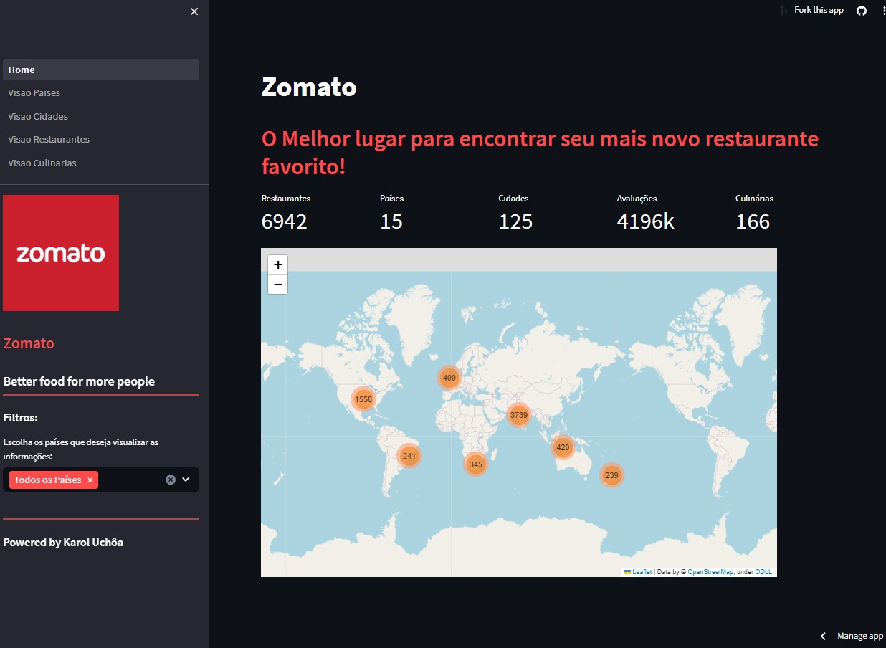
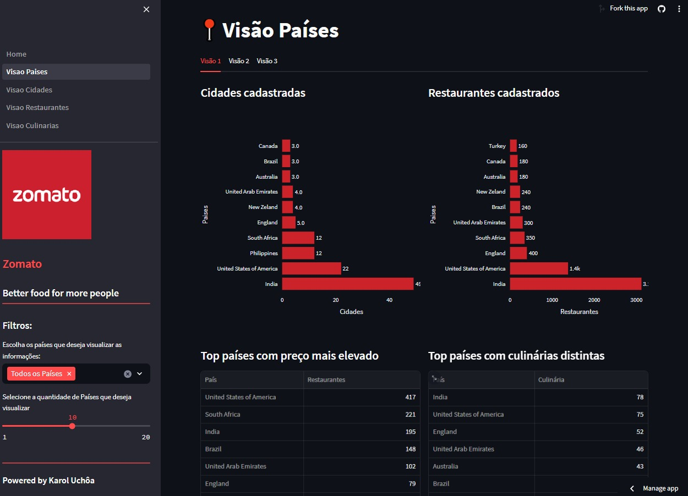
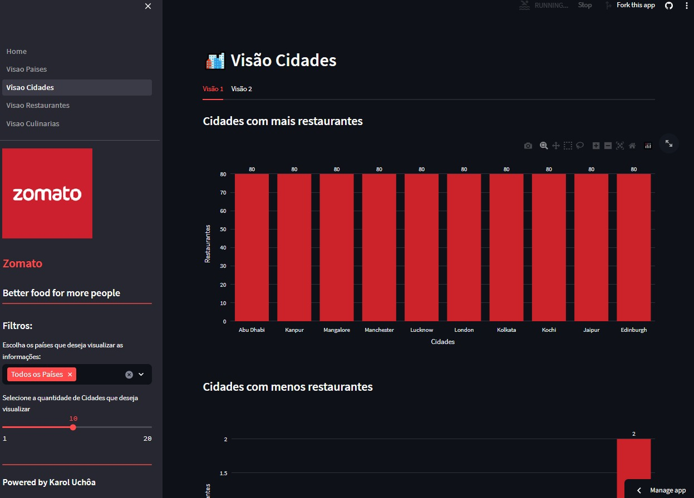
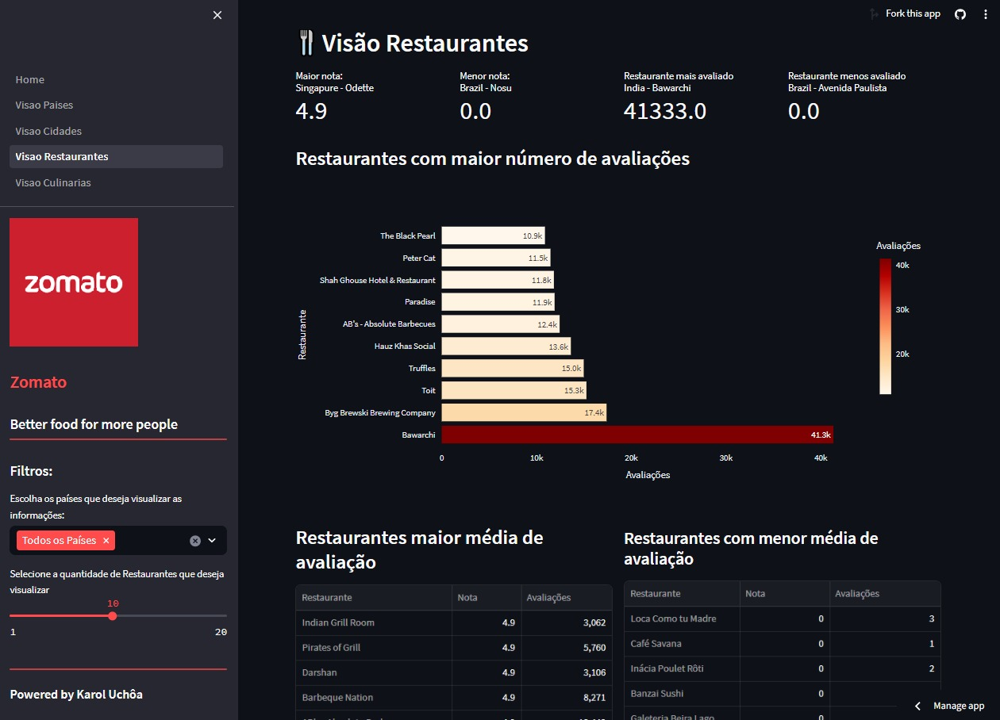
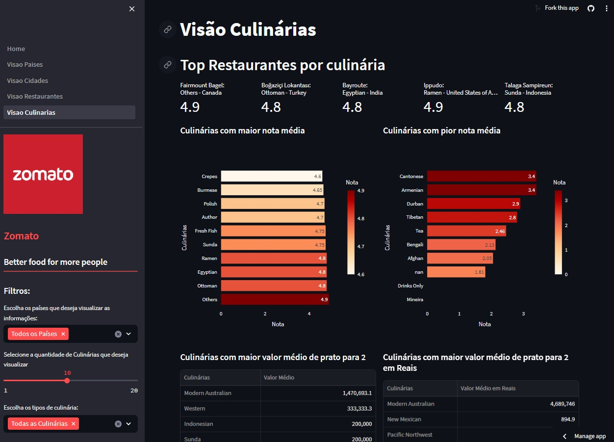
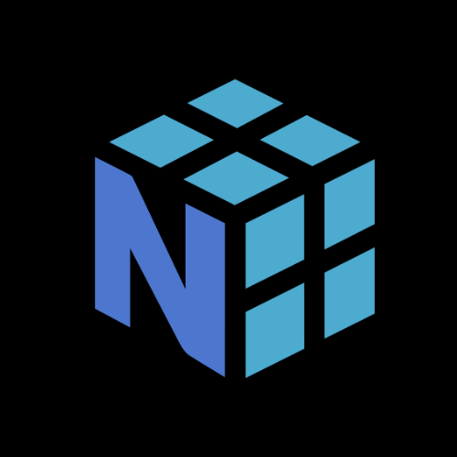

# Zomato

## 🔎 Problema de Negócio

A Zomato é um marketplace de restaurantes, cujo objetivo principal é facilitar o encontro e as negociações entre clientes e restaurantes. Os restaurantes registram suas informações na plataforma da Zomato, incluindo endereço, tipo de culinária, disponibilidade de reservas, serviço de entrega e avaliações dos serviços e produtos. Para melhor compreender o negócio e tomar decisões estratégicas mais informadas, é crucial realizar uma análise aprofundada dos dados da empresa e criar dashboards que respondam às seguintes perguntas:

### 🌎 Visão Geral

- Quantos restaurantes únicos estão registrados?
- Quantos países únicos estão registrados?
- Quantas cidades únicas estão registradas?
- Qual é o total de avaliações feitas?
- Qual é o total de tipos de culinária registrados?

### 📍 Visão Países

- Quantas cidades únicas estão registradas por país?
- Quantos restaurantes únicos estão registrados por país?
- Quais países têm os preços mais elevados?
- Qual é a quantidade de avaliações por país
- Qual é a quantidade de restaurantes que aceitam reservas por país?
- Quais são os países com as maiores notas médias?
- Quais são os países com as menores notas médias?
- Qual é a média de avaliações por país?
- Qual é a média de valor de prato para 2 por país?
- Quais países têm pratos 'gourmet' mais caros em Reais?
- Quais países possuem os pratos mais caros em Reais?
- Quais países possuem os pratos mais baratos em Reais?
- Quais tipos de preço têm a maior quantidade de restaurantes cadastrados por país?

### 🏙️ Visão Cidades

- Quais cidades possuem mais restaurantes cadastrados?
- Quais cidades possuem menos restaurantes cadastrados?
- Quais são as cidades com maior valor de prato para 2?
- Quais são as cidades com maior valor de prato para 2 em reais?
- Quais são as cidades com mais restaurantes avaliados com nota excelente?
- Quais são as cidades com mais restaurantes avaliados com nota baixa?
- Quais são as cidades com maior variedade de culinárias distintas?
- Quais cidades têm mais restaurantes que fazem reservas?
- Quais cidades têm mais restaurantes que fazem entregas?
- Quais cidades têm mais restaurantes que aceitam pedidos online?

### 🍴 Visão Restaurantes

- Qual restaurante possui a maior nota? Em qual país está localizado?
- Qual restaurante possui a menor nota? Em qual país está localizado?
- Qual restaurante tem menos avaliações? Em qual país está localizado?
- Quais são os restaurantes com mais avaliações?
- Quais são os restaurantes com maior média de avaliação?
- Quais são os restaurantes com menor média de avaliação?
- Quais são os restaurantes que servem culinária brasileira com as maiores notas?
- Quais são os restaurantes com maior valor de prato para 2?
- Quais são os restaurantes com maior valor de prato para 2 em Reais?

### 🍝 Visão Culinárias

- Entre os restaurantes com as maiores notas, quais são as culinárias e onde estão localizados?
- Quais são as culinárias com as maiores médias de notas?
- Quais são as culinárias com as menores médias de notas?
- Quais são as culinárias com os maiores valores médios de prato para 2?
- Quais são as culinárias com os maiores valores médios de prato para 2 em Reais?
- Quais culinárias possuem mais restaurantes que aceitam pedidos online e fazem entregas?

## ❗ Premissas do Negócio

- O modelo de negócio adotado é o de um marketplace.
- As três principais visões do negócio são: Visão Países, Visão Cidades, Visão Restaurantes e Visão Culinárias.

## 💻 Tecnologias Utilizadas

Este projeto foi desenvolvido utilizando as seguintes tecnologias e ferramentas:

- Linguagem de Programação: Phyton
- Bibliotecas de Análise de Dados: pandas, numpy, plotly e folium
- Ferramenta de Desenvolvimento de Dashboards: Streamlit
- Plataforma de Hospedagem em Nuvem: GitHub
- Banco de Dados: Kaggle (Zomato Restaurants)

  
  
  
  
  
  
  
  

  
## ♟️ Estratégia da Solução

O painel estratégico foi desenvolvido usando métricas que refletem as três principais visões do modelo de negócio da empresa:

1. Visão do Crescimento dos Países
2. Visão do Crescimento das Cidades
3. Visão do Crescimento dos Restaurantes
4. Visão do Crescimento das Culinárias

Cada visão é representada por um conjunto específico de métricas, fornecendo insights valiosos para a tomada de decisões estratégicas.

## 💡 Top 3 Insights de Dados

1. A Índia possui o maior número de restaurantes cadastrados, mas suas avaliações têm notas próximas às do Brasil, que possui menos restaurantes registrados.
2. Apesar do grande número de restaurantes na Índia, a Indonésia possui um número significativamente maior de avaliações na plataforma.
3. A culinária indiana não é a mais popular, apesar da Índia ter um grande número de restaurantes e cidades cadastrados na plataforma.

## ✅ Produto Final do Projeto

Desenvolvemos um painel online hospedado na nuvem, acessível a partir de qualquer dispositivo conectado à internet. Você pode acessar o painel através deste link:  <a href="https://zomato.streamlit.app/" target="_blank">Clique para ver o resultado</a>

## 📊 Conclusão

O objetivo deste projeto é criar um conjunto de gráficos e tabelas que apresentem métricas de forma eficaz para o CEO e outros interessados. As análises fornecem insights cruciais para a tomada de decisões estratégicas.

## ⏭️ Próximos Passos

1. Refinar o conjunto de métricas.
2. Adicionar filtros personalizados.
3. Incorporar novas visões de negócio.
4. Explorar a possibilidade de visualização em outras plataformas.

## Contatos:

   

